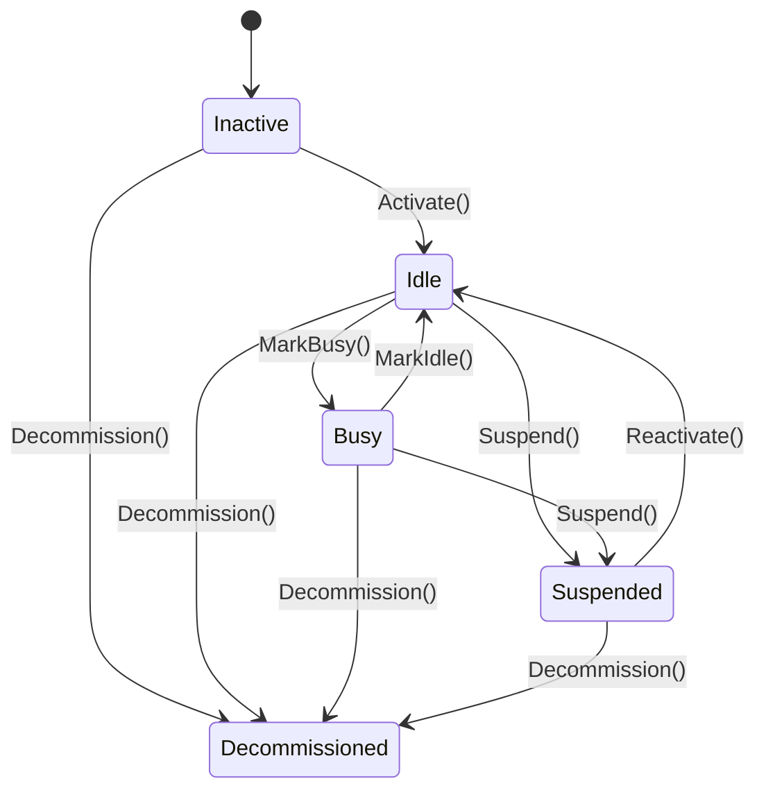
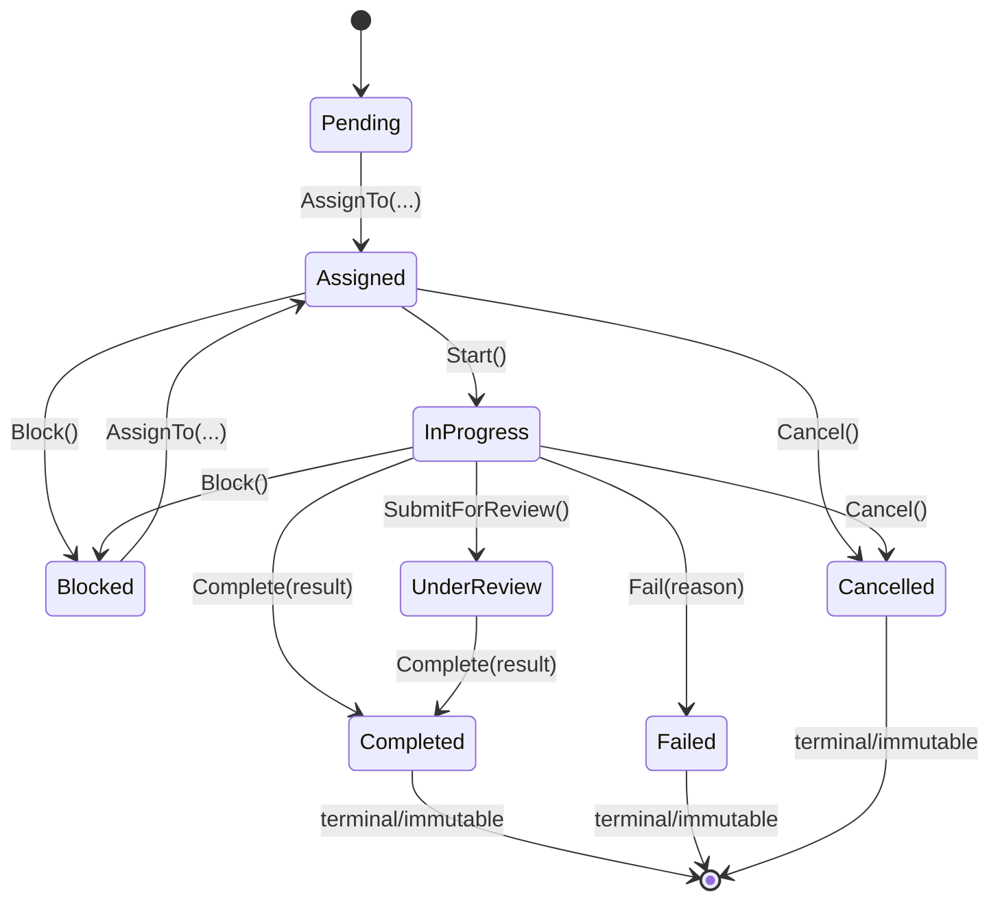
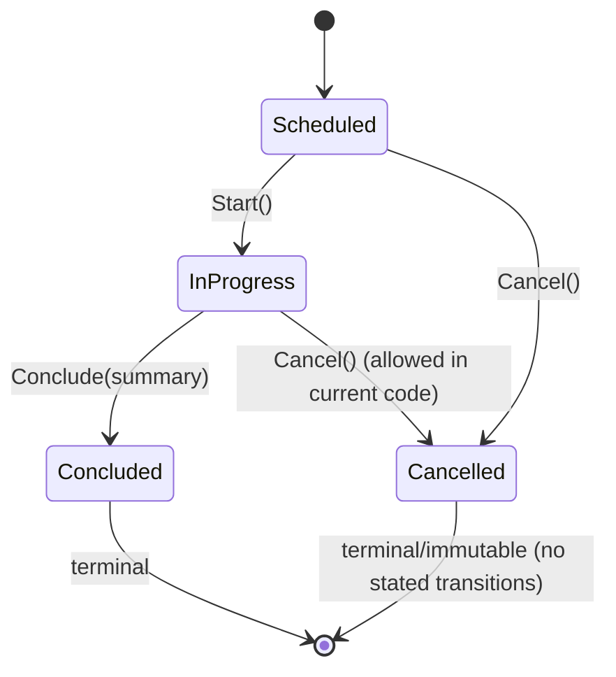
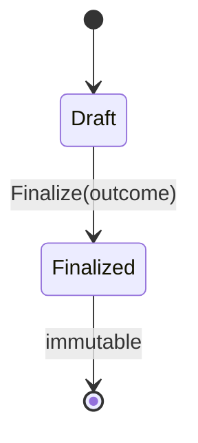
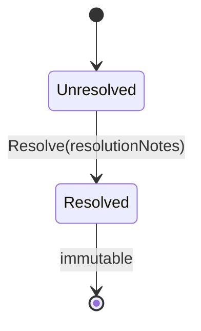
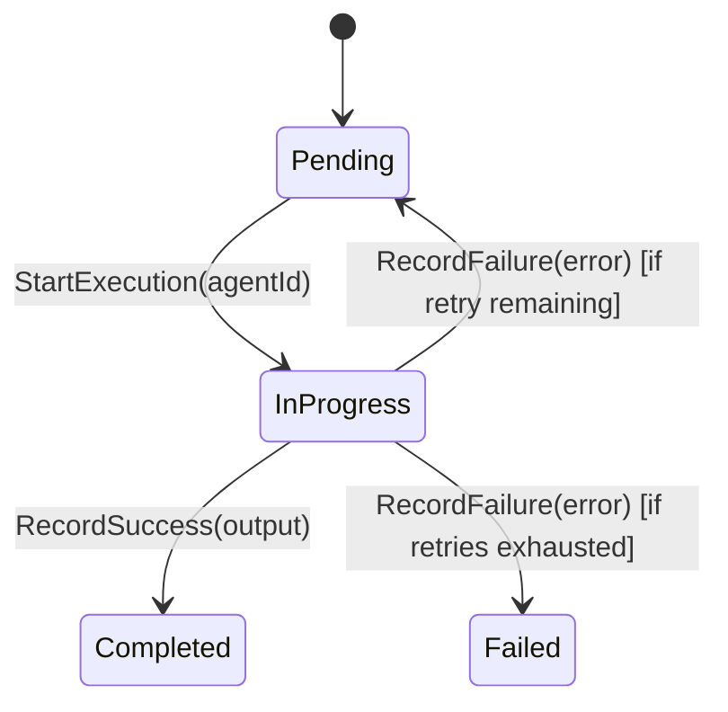

# Lifecycle Flows

This document describes the major lifecycle flows governed by the Domain Layer.

All flows are implemented as **state machines** inside aggregate methods with explicit guards and invariants.

---

## 1. Agent Lifecycle

**Aggregate:** `Agent`  
**States:** `Inactive`, `Idle`, `Busy`, `Suspended`, `Decommissioned`

**Key guards**
- Activation only from `Inactive`.
- Busy only from `Idle`.
- Idle cannot be entered from `Inactive` or `Decommissioned`.
- Reactivation requires `Suspended`.
- Decommission is irreversible.

---

## 2. Task Lifecycle (Canonical)

**Aggregate:** `Task`  
**States:** `Pending`, `Assigned`, `InProgress`, `Blocked`, `UnderReview`, `Completed`, `Failed`, `Cancelled`

**Key invariants**
- Assignment allowed only from `Pending` or `Blocked`.
- Completion/failure/cancellation produce terminal states.
- Terminal states are immutable: domain methods are blocked by `EnsureNotTerminal()`.
- `AssignTo` requires `AgentEligibility.CanAcceptWork == true`.

---

## 3. Meeting Lifecycle

**Aggregate:** `Meeting`  
**States:** `Scheduled`, `InProgress`, `Concluded`, `Cancelled`

**Key guards**
- `Start()` only from `Scheduled`.
- `Conclude()` only from `InProgress`.
- Messages can only be posted while `InProgress`.
- Sender must be a participant.
- Participants can be added only while `Scheduled`.
- Minimum distinct participants enforced at scheduling time (>=2).

---

## 4. Decision Lifecycle

**Aggregate:** `Decision`  
**States:** Draft (implicit), Finalized (`IsFinalized = true`)

**Key guards**
- Drafting requires CEO role.
- Finalizing requires CEO role and must be done by the drafting agent.
- Finalized decisions are immutable.

---

## 5. BugReport Lifecycle

**Aggregate:** `BugReport`  
**States:** Unresolved (implicit), Resolved (`IsResolved = true`)

**Key guards**
- Filing requires QA role.
- Resolution notes are mandatory.
- Resolved bugs cannot be reassigned, re-linked, or have severity changed.
- Resolve is idempotent.

---

## 6. WorkItem Execution Lifecycle

**Entity:** `WorkItem` (contained in Task boundary by convention)  
**States:** `Pending`, `InProgress`, `Completed`, `Failed`

**Key invariants**
- Cannot start completed work items.
- Cannot start when already in progress.
- Retries constrained by `MaxRetries = 3`.
- `CanRetry()` true only when `Status == Pending` and retry count within limits.

